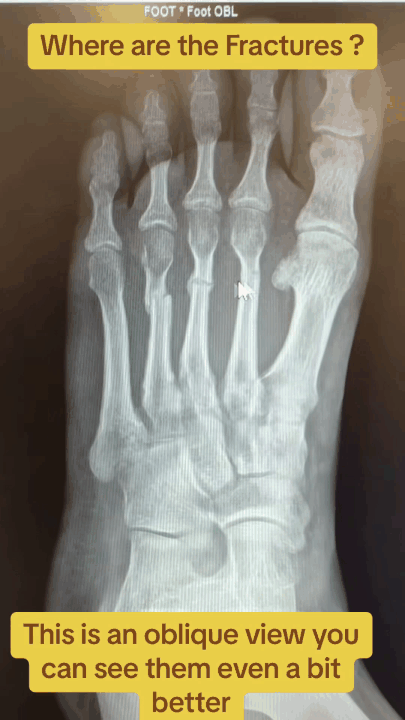
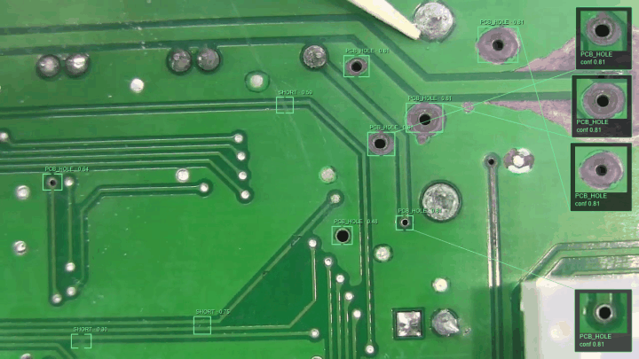
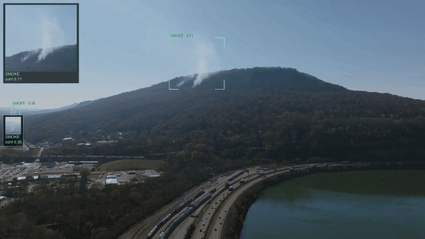

# detection_display

🇫🇷 [Français](#français) · 🇬🇧 [English](#english)

  

---

## Français

**Un pipeline de détection embarqué, générique et interchangeable : on branche un modèle, on obtient une vidéo annotée en direct, avec un zoom amélioré sur chaque détection.**

### Ce que fait le produit

`detection_display` prend un flux vidéo (caméra en direct ou fichier), y détecte des objets grâce à un modèle d'IA accéléré matériellement, et affiche le résultat en temps quasi réel :

- **Plein cadre annoté** : chaque détection est entourée d'une *bounding box* discrète (crochets d'angle) avec son libellé et son score de confiance, sans masquer la scène.
- **Vignettes incrustées** : chaque détection est recadrée, agrandie et améliorée par super-résolution, puis affichée dans un panneau relié à son objet. Un détail minuscule dans l'image devient lisible d'un coup d'œil.
- **Lecture de texte (OCR)** : sur les vignettes, pour les cas d'usage où le texte compte (plaques d'immatriculation, par exemple).
- **Sélection des vignettes** : le nombre de vignettes et le score minimum sont réglables, afin que l'écran reste lisible même quand la scène est chargée. Toutes les détections restent encadrées.

La vignette n'est pas une alarme : c'est un **porteur d'attention** — « voici ce que j'ai détecté, regarde de plus près ».

### Un cœur indépendant du domaine

Le modèle de détection est **interchangeable**. Un *cas d'usage* est un simple profil de configuration (modèle, classes à détecter, réglages des vignettes, lecture de texte oui/non) : changer de domaine ne demande pas de changer de pipeline.

### Aperçu

| Fracture | Circuit imprimé (PCB) | Feu de forêt |
|:---:|:---:|:---:|
|  |  |  |

### Modes de fonctionnement

| Mode | Description |
|---|---|
| **Direct** | détection et affichage en temps quasi réel depuis la caméra |
| **Enregistrement** | enregistre la vidéo et les détections, avec ou sans affichage simultané |
| **Relecture** | rejoue un enregistrement avec **le même rendu que le direct**, sans accélérateur IA : pause, ralenti, accéléré, saut à un instant précis |
| **Recherche** | retrouve dans les enregistrements passés les moments où une classe d'objets a été vue, filtrés par score et par plage de temps, regroupés en événements, avec saut direct à l'instant dans la vidéo |

La source peut aussi être un **fichier vidéo** (lecture en temps réel ou à débit maximal, avec bouclage) : pratique pour évaluer un modèle sur des scènes reproductibles.

### Enregistrements et corpus

Chaque enregistrement produit un jeu de données synchronisé : la vidéo, un journal horodaté de toutes les détections, et, en option, les vignettes améliorées. Ce corpus permet de rejouer une session à l'identique, de la fouiller sans refaire d'inférence, et de constituer des jeux de scènes pour comparer des modèles.

### Matériel

Le produit s'appuie sur du matériel embarqué, compact et peu gourmand :

- un **Raspberry Pi 5** ;
- un **accélérateur d'IA Hailo-8** pour l'inférence (détection, et lecture de texte selon le cas d'usage) ;
- une **caméra Raspberry Pi** grand-angle ;
- une **sortie vidéo HDMI**, y compris sans bureau graphique, par exemple vers un écran ou un projecteur.

La relecture, la recherche et la lecture de fichiers ne nécessitent ni accélérateur ni caméra : elles fonctionnent aussi sur un poste classique.

### Licence

À définir.

---

## English

**An embedded, generic and swappable detection pipeline: plug in a model, get a live annotated video with an enhanced zoom on every detection.**

### What it does

`detection_display` takes a video stream (live camera or file), detects objects with a hardware-accelerated AI model, and displays the result in near real time:

- **Annotated full frame**: each detection is outlined with a discreet bounding box (corner brackets), its label and confidence score, without hiding the scene.
- **Inset thumbnails**: each detection is cropped, enlarged and enhanced with super-resolution, then shown in a panel linked to its object. A tiny detail in the image becomes readable at a glance.
- **Text reading (OCR)**: on the thumbnails, for use cases where text matters (license plates, for instance).
- **Thumbnail selection**: the number of thumbnails and the minimum score are adjustable, so the screen stays readable even in busy scenes. Every detection stays outlined.

The thumbnail is not an alarm: it is an **attention carrier** — "here is what I detected, take a closer look".

### A domain-independent core

The detection model is **swappable**. A *use case* is simply a configuration profile (model, classes to detect, thumbnail settings, text reading on/off): switching domain does not require changing the pipeline.

### Preview

| Fracture | Printed circuit board (PCB) | Forest fire |
|:---:|:---:|:---:|
|  |  |  |

### Operating modes

| Mode | Description |
|---|---|
| **Live** | near real-time detection and display from the camera |
| **Record** | records the video and the detections, with or without live display |
| **Playback** | replays a recording with **the same rendering as live**, without an AI accelerator: pause, slow motion, fast forward, jump to a given moment |
| **Search** | finds in past recordings the moments when a class of objects was seen, filtered by score and time range, grouped into events, with a direct jump to that moment in the video |

The source can also be a **video file** (real-time or full-speed playback, with looping): handy to evaluate a model on reproducible scenes.

### Recordings and corpus

Each recording produces a synchronized dataset: the video, a timestamped log of every detection, and optionally the enhanced thumbnails. This corpus makes it possible to replay a session identically, to search it without re-running inference, and to build scene sets to compare models.

### Hardware

The product relies on compact, low-power embedded hardware:

- a **Raspberry Pi 5**;
- a **Hailo-8 AI accelerator** for inference (detection, and text reading depending on the use case);
- a wide-angle **Raspberry Pi camera**;
- an **HDMI video output**, including without a desktop environment, for example to a display or a projector.

Playback, search and file reading need neither an accelerator nor a camera: they also run on a regular computer.

### License

To be defined.
